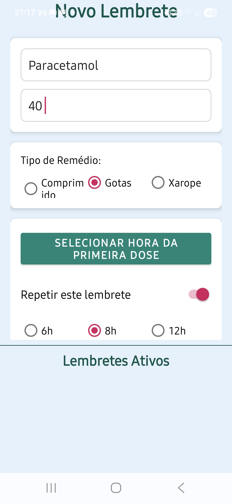
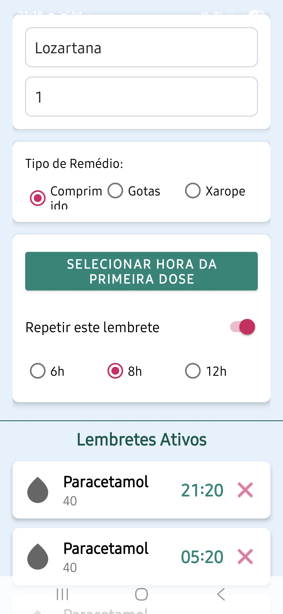

MedicinApp - Lembrete de Remédios Nativo para Android
Um aplicativo de lembrete de medicamentos para Android, construído com Kotlin nativo, focado na simplicidade e na fiabilidade para garantir que a dose certa seja tomada na hora certa.

💙 Este projeto nasceu de uma necessidade pessoal e de um profundo carinho: criar uma ferramenta 100% fiável para ajudar os meus pais a gerir os seus medicamentos diários. 
O MedicinApp não é apenas um software, mas sim uma demonstração de como a tecnologia pode ser usada para cuidar de quem amamos, com uma interface desenhada para ser intuitiva, 
clara e acessível, especialmente para utilizadores com alguma dificuldade em alarmes que vem pre instalado nos aparelhos.

🛠️ Tecnologias Utilizadas
Este projeto foi construído utilizando as tecnologias e arquiteturas mais modernas recomendadas pela Google para o desenvolvimento Android nativo:

Linguagem: Kotlin

Arquitetura: Foco em Activity única com gestão de UI moderna.

Base de Dados: Room Persistence Library para guardar os lembretes de forma segura e permanente no dispositivo.

Programação Assíncrona: Kotlin Coroutines e Flow para operações de base de dados e atualizações de UI reativas e eficientes.

Interface do Utilizador (UI): XML com ViewBinding e componentes do Material Design 3.

Sistema de Alarmes: AlarmManager para garantir o agendamento de alarmes exatos e fiáveis, que funcionam mesmo com o aplicativo fechado ou no modo "Não Incomodar".

Notificações: NotificationManager com canais de notificação de alta prioridade, ações personalizadas ("Tomei", "Adiar") e ícones dinâmicos.

Gestão de Dependências: Gradle Kotlin DSL.

✨ Funcionalidades Principais
Criação de Lembretes Simples: Uma interface limpa para adicionar o nome, a dosagem e o tipo de medicamento (comprimido, gotas ou xarope).

Agendamento Flexível: Defina a hora da primeira dose e escolha se é uma dose única ou se se repete a cada 6, 8 ou 12 horas.

Alarmes Fiáveis: O som do alarme respeita o volume de alarme do sistema (não o de notificações) e tem a capacidade de ignorar o modo "Não Incomodar".

Notificações Interativas: Cada notificação vem com botões de ação rápida:

"Tomei": Dispensa a notificação.

"Adiar 5 min": Reagenda o alarme para 5 minutos mais tarde.

Lista de Lembretes Ativos: Visualize todos os seus alarmes agendados diretamente na tela principal.

Gestão de Lembretes: Cancele um lembrete a qualquer momento com um simples clique.

Persistência de Dados: Os lembretes são guardados numa base de dados local, garantindo que não se perdem ao reiniciar o telemóvel.

Tela de Abertura (Splash Screen): Uma abertura profissional que melhora a experiência inicial.

Screenshots

Tela Principal

Notificação com Ações

🚀 Desafios e Aprendizados
A jornada de desenvolvimento deste aplicativo foi um profundo aprendizado. O maior desafio foi garantir a fiabilidade absoluta do sistema de alarmes em diferentes versões e fabricantes de Android. 
Este projeto solidificou os meus conhecimentos em componentes essenciais do Android Jetpack, como Room, LifecycleScope, e a gestão avançada do AlarmManager.

📥 Como Executar
Para executar este projeto, você vai precisar do Android Studio.

# Clone este repositório
$ git clone [https://github.com/silvatechf/MedicinApp.git](https://github.com/silvatechf/MedicinApp.git)

